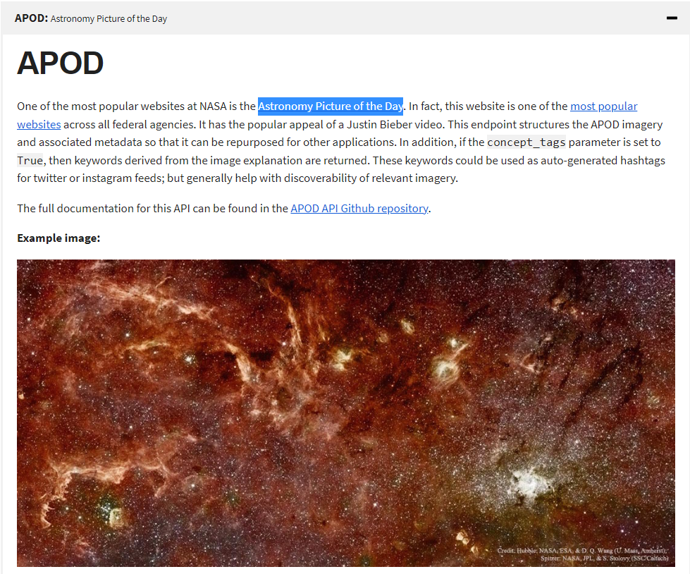

[](https://www.linkedin.com/in/marcus-vinicius-de-miranda)
[](https://www.instagram.com/marcusmiran/)
[](https://www.twitch.tv/lyazmat)

## Exercício de API - Tera

<br>

Deploy em:

[](https://lyazmat.github.io/nasa-apod/)


<br>

<p>
O exercício consiste em consumir a API fornecida pela NASA, para informar a imagem do dia junto ao título e sua explicação ao Usuário.
</p>
<p>
Para isso usaremos a APOD API (Astronomy Picture of the Day).</p>
<p>
Link em: <a href="https://api.nasa.gov/#browseAPI">API - NASA</a>
</p>
<br>


<p align="center">
  
</p>

<br>
<br><h2>HTTP Request</h2>
<p>O acesso da API é dado por:</p>
<span style="background-color: #ccc; color: black;">GET https://api.nasa.gov/planetary/apod</span>
<br>
<br>
<p>Alguns parâmetros são:</p>

<h4>

|  Parameter |    Type    | Default | Description |
|:----------:|:----------:|:-------:|-------------|
|  api_key   | string |  none  | Token key to API access |
|    date    | YYYY-MM-DD |  today  | The date of the APOD image to retrieve |
| start_date | YYYY-MM-DD |   none  | The start of a date range, when requesting date for a range of dates. Cannot be used with date. |
|  end_date  | YYYY-MM-DD |   none  | The end of the date range, when used with start_date. |

</h4>

<br><h2>Códigos</h2>

<h3>HTML</h3><br>

```html
<!DOCTYPE html>
<html lang="pt-BR">

<head>
    <meta charset="UTF-8" />
    <meta name="viewport" content="width=device-width, initial-scale=1.0" />
    <link href="https://cdn.jsdelivr.net/npm/bootstrap@5.2.0/dist/css/bootstrap.min.css" rel="stylesheet" integrity="sha384-gH2yIJqKdNHPEq0n4Mqa/HGKIhSkIHeL5AyhkYV8i59U5AR6csBvApHHNl/vI1Bx" crossorigin="anonymous">
    <link href="https://getbootstrap.com/docs/5.2/assets/css/docs.css" rel="stylesheet">
    <link href="./assets/css/nasa.css" rel="stylesheet">
    <script src="https://ajax.googleapis.com/ajax/libs/jquery/3.6.0/jquery.min.js"></script>
    <script src="https://cdn.jsdelivr.net/npm/bootstrap@5.2.0/dist/js/bootstrap.bundle.min.js" integrity="sha384-A3rJD856KowSb7dwlZdYEkO39Gagi7vIsF0jrRAoQmDKKtQBHUuLZ9AsSv4jD4Xa" crossorigin="anonymous"></script>
</head>

<body>
    <div class="container-fluig p-5">
        <div class="row mb-5">
            <div class="col-sm-12">
                <label class="me-3"><strong>Início</strong> <input id="inicio" type="date" class="form-control form-control-sm" /></label>
                <label><strong>Fim</strong> <input id="fim" type="date" class="form-control form-control-sm" /></label>
            </div>
        </div>
        <div class="row lista-imagem"></div>
    </div>
    <script src="./assets/js/nasa.js"></script>
</body>

</html>
```

<h3>CSS</h3><br>

```css
body {
    min-height: 100vh;
}

p {
    text-align: justify;
}

p.fs-3 {
    text-align: center !important;
}
```

<h3>Javascript</h3><br>

```javascript
// https://api.nasa.gov/planetary/apod?api_key=521rEK1dghO2zF4gOTNi7dvo6P7EKvqCEahBUv03
// 521rEK1dghO2zF4gOTNi7dvo6P7EKvqCEahBUv03

// Função para adicionar 1 (um) zero se número for menor que 9
const twoDigits = (numero) => {
    return numero <= 9 ? '0' + numero : numero;
}

// Função que pega um objeto Date e transforma numa string YYYY-mm-dd
const convertDate = (date) => {
    return `${hoje.getFullYear()}-${twoDigits(hoje.getMonth())}-${twoDigits(hoje.getDay())}`
}

// Função que converte string YYYY-mm-dd em string dd/mm/YYYY
const convertDateBr = (date) => {
    let date_br = date.split('-')
    return [date_br[2], date_br[1], date_br[0]].join('/')
}

var start = document.getElementById("inicio");
var end = document.getElementById("fim");
const lista = document.querySelector(".lista-imagem")

// Setar a data máxima dos inputs para o dia de hoje
var hoje = new Date();
start.setAttribute('max', convertDate(hoje))
end.setAttribute('max', convertDate(hoje))

// Setar valores iniciais para data de hoje
start.setAttribute('value', convertDate(hoje))
end.setAttribute('value', convertDate(hoje))

function mostraImagemDaNasa() {
    if (start.value && end.value) {
        document.body.style.cursor = "wait";
        fetch(
                `https://api.nasa.gov/planetary/apod?api_key=521rEK1dghO2zF4gOTNi7dvo6P7EKvqCEahBUv03&start_date=${start.value}&end_date=${end.value}`
            )
            .then((resp) => resp.json())
            .then((dados) => {
                console.log({ dados });

                lista.innerHTML = "";
                dados.forEach(element => {
                    let media = ""
                    if (element.media_type === 'video') {
                        media = `<iframe class="w-100" height="400" src="${element.url}"></iframe>`
                    } else if (element.media_type === 'image') {
                        media = ``
                    }
                    lista.innerHTML += `
                    <div class="col-12 col-sm-6 col-md-4 col-xl-3 p-3">
                        <div class="p-3 border border-muted border-3 rounded-3 h-100">
                            <p class="fs-6 text-center bg-dark text-white p-1">${convertDateBr(element.date)}</p>
                            <p class="fs-3">${element.title}</p>
                            <p class="small">${element.explanation}</p>
                            ${media}
                        </div>
                    </div>`;
                });
                document.body.style.cursor = "auto";
            });
    }
}

mostraImagemDaNasa();


start.addEventListener("change", mostraImagemDaNasa, false);
end.addEventListener("change", mostraImagemDaNasa, false);
```